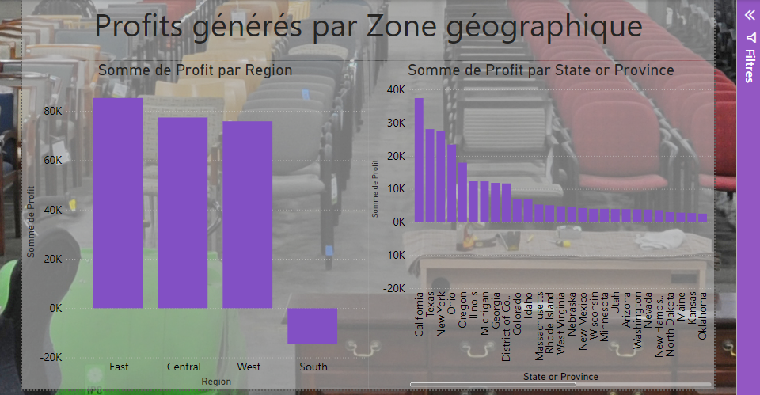
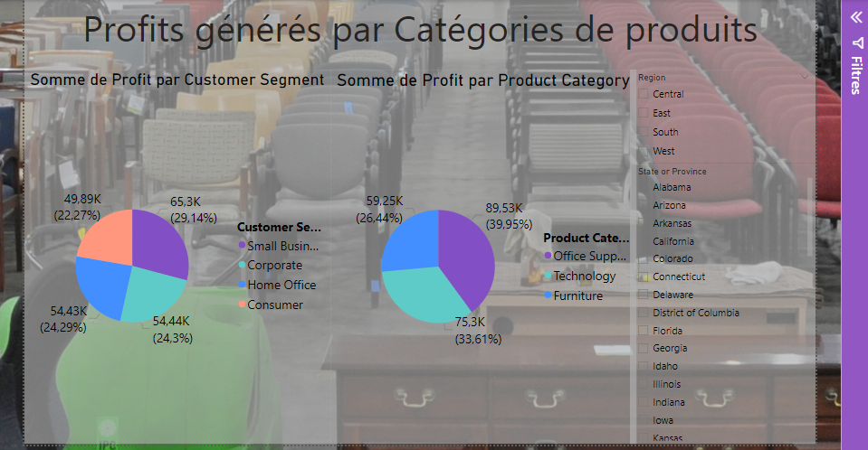
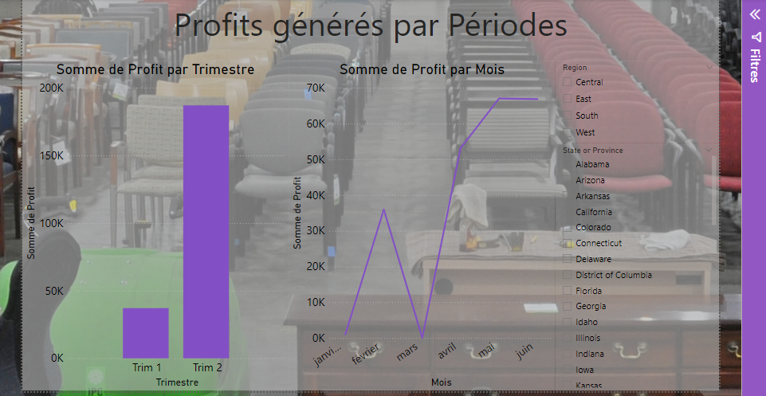
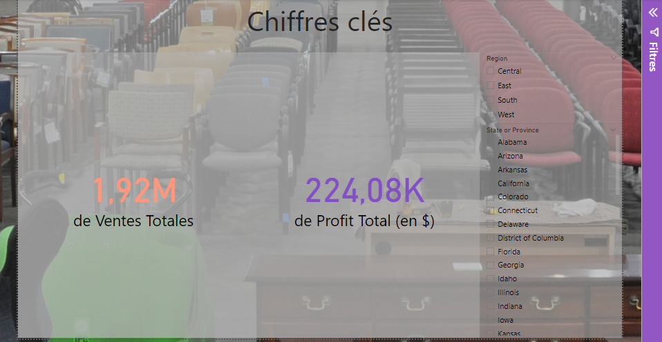

# Analyse des Ventes de Sample Superstore

Source du dataset : [Sample Superstore Sales](https://hackernoon.com/13-best-datasets-for-power-bi-practice)

Le projet d'analyse des ventes de Sample Superstore vise à visualiser et analyser les données de ventes d'une entreprise de vente au détail fictive. Le jeu de données comprend des informations détaillées sur les commandes, les clients, les produits et les bénéfices. Cette analyse permet de comprendre les performances des ventes à travers différentes régions, segments de clients, catégories de produits et périodes.

## Description du jeu de données

Le jeu de données utilisé pour cette analyse comprend les variables suivantes :

- Order ID : Un identifiant unique pour chaque commande.
- Customer ID : Un identifiant unique pour chaque client.
- Order Date : La date à laquelle la commande a été passée.
- Ship Date : La date à laquelle la commande a été expédiée.
- Ship Mode : Le mode d'expédition de la commande (par exemple, standard, jour même).
- Segment : Le segment de client (par exemple, Consommateur, Entreprise, Bureau à domicile).
- Region : La région où le client est situé (par exemple, Ouest, Centre, Est).
- Category : La catégorie du produit acheté (par exemple, Mobilier, Technologie, Fournitures de bureau).
- Sub-Category : La sous-catégorie du produit acheté (par exemple, Chaises, Ordinateurs de bureau, Papier).
- Product Name : Le nom du produit acheté.
- Sales : Le chiffre d'affaires pour le produit acheté.
- Quantity : Le nombre d'unités du produit acheté.
- Discount : La remise appliquée au produit acheté.
- Profit : Le bénéfice généré par le produit acheté.

## Visualisations

Le projet comprend plusieurs visualisations clés pour analyser les données de ventes sous différents angles :

    Profits Générés par Zone Géographique
        Profit par Région : Un graphique à barres montrant le profit total pour chaque région.
        Profit par État ou Province : Un graphique à barres montrant le profit total pour chaque état ou province.

    Profits Générés par Catégories de Produits
        Profit par Segment de Clientèle : Un graphique en secteurs montrant le profit total pour chaque segment de clientèle.
        Profit par Catégorie de Produit : Un graphique en secteurs montrant le profit total pour chaque catégorie de produit.

    Profits Générés par Périodes
        Profit par Trimestre : Un graphique à barres montrant le profit total pour chaque trimestre.
        Profit par Mois : Un graphique linéaire montrant le profit total pour chaque mois.

    Chiffres clés
        Indicateurs Clés de Performance (KPI) : Des indicateurs clés de performance pour les ventes totales et le profit total

## Utilisation

    Filtres : Le tableau de bord comprend des slicers interactifs pour filtrer les données par segments, régions, catégories et dates.
    Indicateurs Clés de Performance (KPI) : Des indicateurs clés de performance pour les ventes totales et le profit total sont affichés pour des insights rapides.
    Analyse Détaillée : Des fonctionnalités de drill-down sont disponibles pour une analyse plus granulaire.

## Captures d'écran

## License

This project is licensed under the MIT License - see the [LICENSE](LICENSE) file for details.

